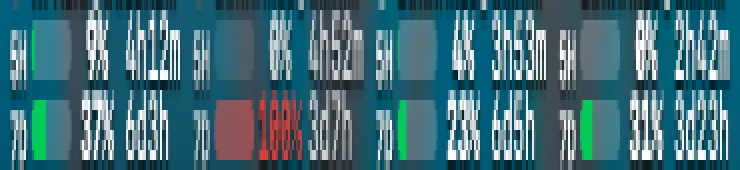

# claude-usage-tray

One glance at every AI quota you pay for, right in the macOS menu bar: one
column per account, email on top, 5h/7d rows below with % and reset time.



Brand glyphs, 8px each, drawn from normalized assets:


## How it works

- `ClaudeUsage` (Swift, AppKit `NSStatusItem`) draws the bar and the menu.
  SwiftUI `MenuBarExtra` renders nothing on some Macs — AppKit it is.
- `server/` (Node, zero dependencies) aggregates one JSON on `:3337`:
  - **claude** from vdm rotation profiles (`:3335`, my private tool —
    without it the tray shows "vdm offline" and the rest works),
  - **codex** via `codex app-server` JSON-RPC (needs the `codex` CLI),
  - **muse** via `server/muse_probe.py` (needs `python3`, Keychain token),
  - **cloud credit** from `~/bin/credito-cloud --json` when present
    (my own tool, optional — the menu section hides without it),
  - manual renewals from `server/renewals.json`.
- The dropdown menu shows every quota with bars, the credit balance, and
  renewal dates. Menu strings are Italian; contributions for i18n welcome.

## credito-cloud protocol (optional)

Any executable at `~/bin/credito-cloud` answering `--json` with
`{"iguana_necktie": {"remaining_dollars": N, "limit_dollars": M,
"used_dollars": K, "resets_at": "ISO"}}` feeds the "Credito AI" menu
section. Missing or failing → the section hides, nothing breaks.

## Install

```sh
./install.sh
```

Builds the Swift binary, writes two LaunchAgents (tray + server) with your
`$HOME`, loads them. Uninstall with `./uninstall.sh` (stops both agents,
leaves the repo alone).

## Config

```sh
cp server/renewals.example.json server/renewals.json
```

`renewals.json` is yours alone (gitignored): services, amounts, renewal
dates. Entries with `"tray": false` stay out of the menu.

Without vdm the Claude provider reports "vdm offline" and the rest works.
Without `credito-cloud` the credit section hides. Everything degrades to
empty instead of failing.

## Tests

```sh
node --test assets/bar-icons.test.mjs   # 72px assets, transparency, 8px hole
node --test server/test.mjs             # mapping + parsing + codex rpc
python3 -m unittest server.test_muse_probe -v   # muse cache/fail-quiet logic
```

## Layout notes

The bar is 22px tall and every coordinate is an integer — fractional
origins smear at 1x. Window tags are 7pt semibold capitals: lowercase
ascenders would kiss the 8px icon above them. See the comments in
`ClaudeUsage.swift`, they explain each number.

## License

MIT — see [LICENSE](LICENSE).
